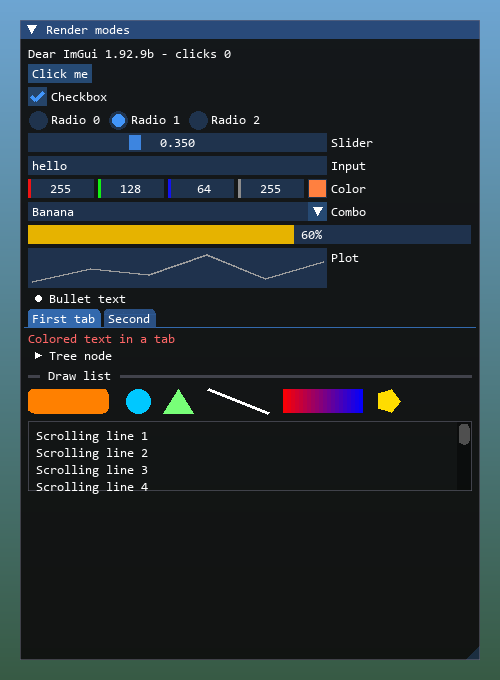

<div align="center">

# Dear ImGui for Roblox

The real [Dear ImGui](https://github.com/ocornut/imgui) v1.92.9b, compiled to Luau, for Roblox executors.<br>
Drawn with Potassium's **DrawingImmediate** or any executor's **Drawing** library.

**[Download](../../releases/latest)** · **[Wiki](../../wiki)** · **[Getting started](../../wiki/Getting-Started)** · **[API guide](../../wiki/Luau-API-Guide)**

</div>

| DrawingImmediate mode | Drawing mode |
|---|---|
|  |  |

## Features

- **Unmodified Dear ImGui**: windows, menus, tabs, tables, trees, plots, color pickers, text input, popups, the demo
  window and the metrics tools. C++ compiled to WebAssembly with Emscripten, translated to Luau with
  [Spider](https://github.com/SovereignSatellite/Spider).
- **The whole API from Luau**: 454 functions generated from [dear_bindings](https://github.com/dearimgui/dear_bindings)
  metadata, named like the C++ API. Out parameters come back as return values; draw lists, style and IO are handles.
- **Two render modes, detected automatically**: DrawingImmediate (Potassium) and the Drawing library (other executors).
- **Real input**: mouse, wheel, keyboard layouts (AZERTY, AltGr, accents), Ctrl+V paste. Clicks and keys don't reach
  the game while you use a window.
- **Text measured with the executor's own fonts**, checked against drawn text at runtime so wrapping stays inside windows.
- **One file**: 4.6 MB, or 3.1 MB without the demo window and debug tools.

## Quick start

Download `imgui_roblox.luau` from the [latest release](../../releases/latest), put it in your executor's workspace
folder, then:

```lua
local ImGui = loadstring(readfile("imgui_roblox.luau"))()
ImGui.Init({ Font = "Monospace", FontSize = 14 }) -- DrawingImmediate on Potassium, Drawing elsewhere

local speed = 16
ImGui.OnFrame(function()
	if ImGui.Begin("Hello") then
		ImGui.Text("Dear ImGui %s", ImGui.GetVersion())
		if ImGui.Button("Click me") then
			print("clicked")
		end
		local _
		_, speed = ImGui.SliderFloat("WalkSpeed", speed, 0, 100)
	end
	ImGui.End()
end)
```

More in the wiki: [Getting started](../../wiki/Getting-Started) · [Init options & render modes](../../wiki/Init-Options-and-Render-Modes) ·
[Luau API guide](../../wiki/Luau-API-Guide) · [Building & internals](../../wiki/Building-and-Internals).
A complete script: [`examples/potassium_demo.luau`](examples/potassium_demo.luau).

## Downloads

| File | Size | |
|---|---|---|
| `imgui_roblox.luau` | 4.6 MB | everything, including `ImGui.ShowDemoWindow()` and the metrics/debug tools |
| `imgui_roblox_lite.luau` | 3.1 MB | the same without the demo window and debug tools |

## Building from source

Needs Python 3.9+ and, for the first setup, [Rust](https://rustup.rs) (Spider is compiled from source). Works on Windows,
macOS and Linux (use `python3` where `python` is missing):

```bash
python build.py setup   # downloads Dear ImGui, dear_bindings, Emscripten, Spider (compiled with cargo) and Luau
python build.py         # builds dist/imgui_roblox.luau and dist/imgui_roblox_lite.luau
python build.py test    # runs every headless test against both bundles
```

`python build.py --help` lists the rest (`full`, `lite`, `bench`, `toolchain`, `clean`, `--opt -Oz` for a smaller
bundle). Step-by-step instructions and troubleshooting: [Building & internals](../../wiki/Building-and-Internals).

## Repository layout

| Path | |
|---|---|
| `build.py` | setup, build, test and benchmark |
| `src/` | C++ backend: font loader, input, draw data export, libc routed to Luau |
| `luau/` | runtime (`ImGui.Init`, input, WebAssembly imports) and renderer (DrawingImmediate, Drawing) |
| `tools/` | bindings generator, Spider output optimizer and minifier, bundler |
| `tests/harness/` | headless tests run with the Luau CLI against mock executor libraries |
| `examples/` | example scripts |

## License

[MIT](LICENSE) for this project. The bundles include Dear ImGui (MIT) and Spider's runtime helpers (MPL-2.0): see
[THIRD_PARTY_NOTICES.md](THIRD_PARTY_NOTICES.md).
