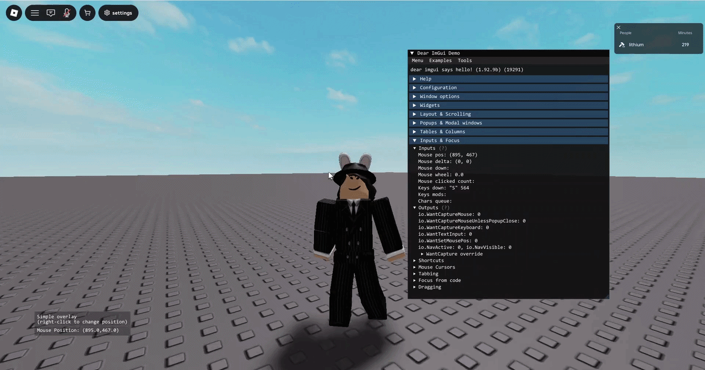

<div align="center">

# Dear ImGui for Roblox

The real [Dear ImGui](https://github.com/ocornut/imgui) v1.92.9b, compiled to Luau, for Roblox executors.<br>
Drawn with Potassium's **DrawingImmediate** or any executor's **Drawing** library.

**[Download](../../releases/latest)** · **[Wiki](../../wiki)** · **[Getting started](../../wiki/Getting-Started)** · **[API guide](../../wiki/Luau-API-Guide)**

</div>



## Our goals

| Values | Meaning |
|---|---|
| **Compatibility** | Runs on Potassium's DrawingImmediate and on any executor with a Drawing library, detected automatically, with any keyboard layout. |
| **Stability** | Unmodified Dear ImGui, and every bundle and every example goes through the headless tests before a release. |
| **Size** | One file per build: 3.1 MB, up to 5.3 MB with docking and the demo window. |
| **Parity** | Dear ImGui's API from Luau under its C++ names, generated from Dear ImGui's own metadata, docking branch included. |
| **Optimization** | The translated code is rewritten, minified and compiled at Luau's optimization level 2: frames about 15% faster than before. |

## Features

- **Unmodified Dear ImGui**: windows, menus, tabs, tables, trees, plots, color pickers, text input, popups, the demo
  window and the metrics tools. C++ compiled to WebAssembly with Emscripten, translated to Luau with
  [Spider](https://github.com/SovereignSatellite/Spider).
- **The whole API from Luau**: 454 functions generated from [dear_bindings](https://github.com/dearimgui/dear_bindings)
  metadata, named like the C++ API. Out parameters come back as return values; draw lists, style and IO are handles.
- **Two render modes, detected automatically**: DrawingImmediate (Potassium) and the Drawing library (other executors).
- **Real input**: mouse, wheel, keyboard layouts (AZERTY, AltGr, accents), Ctrl+V paste. Clicks and keys don't reach
  the game while you use a window.
- **Text measured with the executor's own fonts**, checked against drawn text at runtime so wrapping stays inside windows.
- **Docking**: `docking.luau` is built from Dear ImGui's docking branch, so windows dock into each other and into
  dockspaces.
- **One file per build**: 3.1 MB for Dear ImGui, 3.6 MB with docking; the `_debug` builds add the demo window and the
  debug tools.

## Quick start

Load the latest release straight from GitHub:

```lua
local ImGui = loadstring(game:HttpGet("https://github.com/lithium1on/imgui-roblox/releases/latest/download/imgui.luau"))()
ImGui.Init({ Font = "Monospace", FontSize = 14 }) -- DrawingImmediate on Potassium, Drawing elsewhere

local speed = 16
ImGui.OnFrame(function()
	if ImGui.Begin("Hello") then
		ImGui.Text("Dear ImGui %s", ImGui.GetVersion())
		if ImGui.Button("Click me") then
			print("clicked")
		end
		local _
		_, speed = ImGui.SliderFloat("WalkSpeed", speed, 0, 100)
	end
	ImGui.End()
end)
```

More in the wiki: [Getting started](../../wiki/Getting-Started) · [Init options & render modes](../../wiki/Init-Options-and-Render-Modes) ·
[Luau API guide](../../wiki/Luau-API-Guide) · [Building & internals](../../wiki/Building-and-Internals).

## Examples

| Script | Shows |
|---|---|
| [`hello_world.luau`](examples/hello_world.luau) | the smallest script: one window |
| [`widgets.luau`](examples/widgets.luau) | buttons, sliders, inputs, combos, lists, trees, tabs and plots |
| [`custom_theme.luau`](examples/custom_theme.luau) | a fully custom theme with a theme switcher, a title font and one-off style overrides |
| [`docking_layout.luau`](examples/docking_layout.luau) | panels that dock into each other, with a main menu bar (`docking.luau`) |
| [`overlay.luau`](examples/overlay.luau) | a click-through stats overlay with a frame time graph, and a crosshair |
| [`settings_persistence.luau`](examples/settings_persistence.luau) | settings and window layout saved between runs, a close button that shuts everything down |
| [`player_list.luau`](examples/player_list.luau) | a searchable table of the players in the server with a right-click menu |
| [`console.luau`](examples/console.luau) | a colored, filterable log with a command line |
| [`potassium_demo.luau`](examples/potassium_demo.luau) | the demo window next to a panel of widgets and a draw list (`imgui_debug.luau`) |

`python build.py test` runs every example, so they keep working with each release.

## Downloads

| File | Size | |
|---|---|---|
| `imgui.luau` | 3.1 MB | Dear ImGui: every widget, without the demo window and debug tools |
| `imgui_debug.luau` | 4.6 MB | the same plus `ImGui.ShowDemoWindow()`, the Metrics/Debugger and the other debug tools |
| `docking.luau` | 3.6 MB | Dear ImGui's docking branch: windows dock into each other and into dockspaces |
| `docking_debug.luau` | 5.3 MB | the docking branch plus the demo window and debug tools |

Every file loads the same way; change the name at the end of the URL, e.g. `https://github.com/lithium1on/imgui-roblox/releases/latest/download/docking.luau`.

## Building from source

Needs Python 3.9+ and, for the first setup, [Rust](https://rustup.rs) (Spider is compiled from source). Works on Windows,
macOS and Linux (use `python3` where `python` is missing):

```bash
python build.py setup   # downloads Dear ImGui, dear_bindings, Emscripten, Spider (compiled with cargo) and Luau
python build.py         # builds dist/imgui.luau, imgui_debug.luau, docking.luau and docking_debug.luau
python build.py test    # runs the headless tests against every bundle
```

`python build.py --help` lists the rest (`python build.py docking` for one bundle, `bench`, `toolchain`, `clean`,
`--opt -Oz` for smaller bundles). Step-by-step instructions and troubleshooting: [Building & internals](../../wiki/Building-and-Internals).

## Repository layout

| Path | |
|---|---|
| `build.py` | setup, build, test and benchmark |
| `src/` | C++ backend: font loader, input, draw data export, libc routed to Luau |
| `luau/` | runtime (`ImGui.Init`, input, WebAssembly imports) and renderer (DrawingImmediate, Drawing) |
| `tools/` | bindings generator, Spider output optimizer and minifier, bundler |
| `tests/harness/` | headless tests run with the Luau CLI against mock executor libraries |
| `examples/` | example scripts |

## License

[MIT](LICENSE) for this project. The bundles include Dear ImGui (MIT) and Spider's runtime helpers (MPL-2.0): see
[THIRD_PARTY_NOTICES.md](THIRD_PARTY_NOTICES.md).
